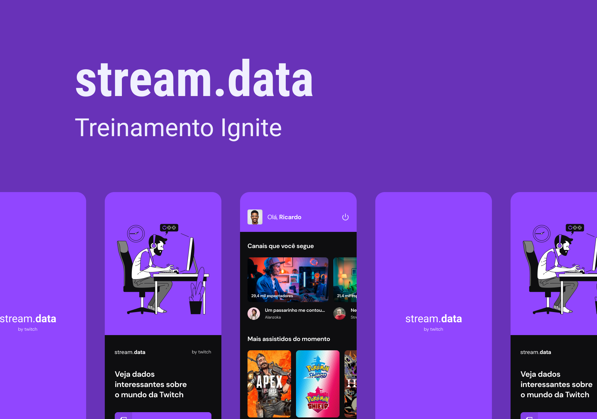

# stream.data

This project was a challenge from the React Native Ignite bootcamp from Rocketseat.

 

## 📸 Overview

    
    

## 💻 Project

This project challenged me to develop an authentication system using Twitch and to use the Context API to share user's information to all the components.

## ✨ Technologies

#### - React Native

#### - TypeScript

#### - Expo
